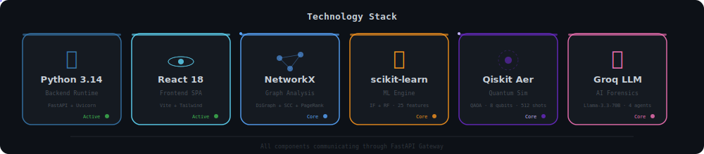

<div align="center">

<!-- ANIMATED HERO BANNER -->


<br/>

<!-- TYPING SVG — TRIPLE LINE -->
<a href="https://git.io/typing-svg"></a>

<br/><br/>

<!-- PRIMARY BADGES -->
<p>
  
  
  
  
  
  
</p>

<!-- STATUS BADGES -->
<p>
  
  
  
  
  
  
</p>

<br/>

<!-- QUICK NAV PILLS -->
<p>
  <a href="#-system-architecture"></a>&nbsp;
  <a href="#-multi-agent-pipeline"></a>&nbsp;
  <a href="#-quantum-qaoa-circuit"></a>&nbsp;
  <a href="#-detection-patterns"></a>&nbsp;
  <a href="#-crime-team--ai-forensics"></a>&nbsp;
  <a href="#-quick-setup"></a>
</p>


</div>

<br/>

## 📊 Impact at a Glance

<div align="center">

<table>
<tr>
<td align="center" width="16%">
<br/>
<sub><b>10K transactions<br/>end-to-end</b></sub>
</td>
<td align="center" width="16%">
<br/>
<sub><b>detected across<br/>4 pattern types</b></sub>
</td>
<td align="center" width="16%">
<br/>
<sub><b>Graph + ML + Quantum<br/>+ Disrupt + Crime</b></sub>
</td>
<td align="center" width="16%">
<br/>
<sub><b>quantum-enhanced<br/>Max-Cut partitioning</b></sub>
</td>
<td align="center" width="16%">
<br/>
<sub><b>interactive React<br/>visualization suite</b></sub>
</td>
<td align="center" width="16%">
<br/>
<sub><b>webhook-driven<br/>alert pipeline</b></sub>
</td>
</tr>
</table>

</div>

<br/>


<br/>

## 🎬 Demo Video

<div align="center">

<a href="https://git.io/typing-svg"></a>

<br/><br/>

### 🎥 Pipeline Explainer (Manim Animation)

https://github.com/user-attachments/assets/MulingNetExplainer.mp4

<video src="./assets/MulingNetExplainer.mp4" width="100%" controls autoplay muted loop>
  Your browser does not support the video tag.
</video>

<br/>

> **📺 Watch the full demo video on LinkedIn** — [LinkedIn Post Link](#)  
> *2-3 min walkthrough covering architecture, detection pipeline, and live demo.*  
> *#RIFTHackathon #MoneyMulingDetection #FinancialCrime*

</div>

<br/>

## 🎯 Executive Summary

> **MulingNetAI** is a production-ready money muling detection engine that combines **graph theory**, **machine learning**, and **quantum computing** into a unified multi-agent pipeline. It processes **10,000 transactions in 7.17 seconds**, identifying **963 fraud rings** across 4 distinct muling patterns — circular flows, smurfing, fan-out layering, and shell networks.

<details>
<summary><b>🔥 The Problem-Solution Matrix (click to expand)</b></summary>

<br/>

| Problem | Traditional Approach | MulingNetAI Solution |
|---|---|---|
| **Circular money flows** | Rule-based flags | **SCC cycle detection** via NetworkX DiGraph |
| **Structured deposits (smurfing)** | Static $3K threshold | **ML anomaly detection** with 25 behavioral features |
| **Complex layering networks** | Manual investigation | **QAOA quantum Max-Cut** for optimal fraud/clean boundary |
| **False positives** (payroll, merchants) | Human review queue | **Automated whitelist** patterns + multi-agent consensus |
| **Slow processing** | Batch overnight | **Real-time 7.17s pipeline** with vectorized computation |
| **Disconnected tools** | Spreadsheet + rules | **9-tab unified dashboard** with interactive vis-network graphs |
| **Investigation bottleneck** | 1 analyst per case | **4 LLM agents** (Llama-3.3-70B) for instant Crime Team briefing |
| **Alert fatigue** | 90%+ false alerts | **Weighted ensemble** scoring (Graph 0.40 + ML 0.35 + Quantum 0.25) |

</details>

<br/>


<br/>

## 🏗️ System Architecture

<div align="center">

<a href="https://git.io/typing-svg"></a>

<br/><br/>



</div>

<details>
<summary><b>🏛️ Architecture Layer Details (click to expand)</b></summary>

<br/>

| Layer | Components | Technology |
|---|---|---|
| **Presentation** | 9 interactive tabs · Graph view · Fraud ring table · Quantum results · Disruption · Crime Team · What-If · Agent charts · Accounts · JSON output | React 18 + Vite + Tailwind CSS + vis-network + Chart.js |
| **API Gateway** | `/api/analyze` · `/api/download` · `/api/health` · `/api/whatif` · `/api/webhook/n8n` | FastAPI + Uvicorn + StaticFiles + CORS |
| **Agent Pipeline** | Graph Agent → ML Agent → Quantum Agent → Aggregator → Disruption → Crime Team | Python 3.14 + NetworkX + scikit-learn + Qiskit + Groq |
| **Data & Compute** | NetworkX DiGraph · Pandas vectorized · scikit-learn dual ensemble · Qiskit Aer QAOA · Matplotlib circuit rendering | SCC + PageRank + IsolationForest + RandomForest + QAOA Max-Cut |

</details>

<br/>


<br/>

## 🤖 Multi-Agent Pipeline

<div align="center">

<a href="https://git.io/typing-svg"></a>

<br/><br/>



</div>

<details>
<summary><b>📋 Pipeline Step Details (click to expand)</b></summary>

<br/>

| Step | Agent | Input | Output | Time |
|---|---|---|---|---|
| **1. CSV Upload** | — | Raw CSV file (10K rows) | Validated transactions | ~0.1s |
| **2. Parse** | CSV Parser | Raw transactions | Normalized DataFrame | ~0.2s |
| **3. Graph Build** | Graph Agent | DataFrame | NetworkX DiGraph (3,059 nodes) | ~0.5s |
| **4. Graph Score** | Graph Agent | DiGraph | `graph_score` per account (0-100) | ~1.2s |
| **5. ML Score** | ML Agent | 25 features | `ml_score` per account (0-100) | ~0.8s |
| **6. Quantum Score** | Quantum Agent | Top 10 rings | `quantum_score` per ring (0-100) | ~2.5s |
| **7. Aggregate** | Aggregator | 3 scores | `final_score` + classification | ~0.1s |
| **8. Report** | Disruption + Crime Team | Top 30 rings | Disruption strategy + LLM briefing | ~1.7s |

**Total: 7.17 seconds** for 10,000 transactions → 3,059 accounts → 963 fraud rings

</details>

<br/>


<br/>

## 📊 Data Flow & Scoring

<div align="center">

<a href="https://git.io/typing-svg"></a>

<br/><br/>



</div>

<br/>

### ⚖️ Weighted Scoring Engine

<div align="center">



</div>

<details>
<summary><b>📐 Scoring Formula & Classification (click to expand)</b></summary>

<br/>

```python
# Weighted Ensemble Formula
final_score = (0.40 × graph_score) + (0.35 × ml_score) + (0.25 × quantum_score)

# Classification Thresholds
if final_score >= 60:   → "Confirmed Mule"    🚨
if final_score >= 25:   → "Suspicious"         ⚠️
else:                   → "Clean"              ✅
```

**Weight Rationale:**
| Agent | Weight | Justification |
|---|---|---|
| **Graph** | `0.40` | Strongest signal — structural patterns (cycles, fan-in/out) are definitive |
| **ML** | `0.35` | 25 behavioral features capture non-obvious anomalies |
| **Quantum** | `0.25` | QAOA Max-Cut provides partition confidence, limited by qubit count |

**Redistribution:** If quantum agent is skipped (ring too small/large), weights become **0.55 Graph + 0.45 ML**

</details>

<br/>


<br/>

## 🔍 Detection Patterns

<div align="center">

<a href="https://git.io/typing-svg"></a>

<br/><br/>



</div>

<details>
<summary><b>🔎 Pattern Technical Details (click to expand)</b></summary>

<br/>

#### 🔴 Pattern 1: Circular Flow (SCC Cycles)

```
A → B → C → D → A  (money returns to origin)
```

- **Detection**: `nx.strongly_connected_components()` → filter by size ≥ 3
- **Scoring**: Cycle length, total volume, frequency of loops
- **Why it matters**: Direct evidence of money return — highest-confidence signal

#### 🟡 Pattern 2: Smurfing / Fan-In

```
S₁ → M     (many small deposits)
S₂ → M     (below $3K reporting threshold)
S₃ → M     (structuring indicator)
```

- **Detection**: In-degree analysis → accounts with many low-value senders
- **Scoring**: Number of unique senders, average amount proximity to threshold
- **Why it matters**: Classic BSA/AML structuring evasion technique

#### 🟣 Pattern 3: Fan-Out / Layering

```
D → R₁     (rapid distribution)
D → R₂     (through mulitple layers)
D → R₃     (obfuscation of source)
```

- **Detection**: Out-degree analysis → accounts distributing to many receivers
- **Scoring**: Distribution speed, layer depth, receiver diversity
- **Why it matters**: Integration phase of money laundering — funds scatter to avoid tracing

#### 🔵 Pattern 4: Shell Networks

```
Dense interconnected cluster with unusually high edge density
```

- **Detection**: Clustering coefficient + density analysis within SCCs
- **Scoring**: Edge density ratio, bi-directional transaction percentage
- **Why it matters**: Synthetic account networks trading between shell entities

</details>

<br/>


<br/>

## 🤖 ML Agent — Anomaly Detection

<details>
<summary><b>🧠 Feature Engineering — 25 Features (click to expand)</b></summary>

<br/>

| # | Feature | Category | Source |
|---|---|---|---|
| 1 | `total_sent` | Volume | Sum of outgoing amounts |
| 2 | `total_received` | Volume | Sum of incoming amounts |
| 3 | `net_flow` | Volume | received − sent |
| 4 | `transaction_count` | Activity | Total transactions |
| 5 | `unique_counterparties` | Network | Unique accounts interacted with |
| 6 | `avg_sent_amount` | Behavior | Mean outgoing value |
| 7 | `avg_received_amount` | Behavior | Mean incoming value |
| 8 | `max_sent` | Extreme | Largest single outgoing |
| 9 | `max_received` | Extreme | Largest single incoming |
| 10 | `std_sent` | Variance | Outgoing volatility |
| 11 | `std_received` | Variance | Incoming volatility |
| 12 | `send_receive_ratio` | Balance | Directional asymmetry |
| 13 | `in_degree` | Graph | Number of incoming edges |
| 14 | `out_degree` | Graph | Number of outgoing edges |
| 15 | `degree_total` | Graph | Total connections |
| 16 | `pagerank` | Graph | Importance in network |
| 17 | `betweenness` | Graph | Bridge node score |
| 18 | `is_in_cycle` | Structure | Part of SCC cycle? |
| 19 | `cycle_count` | Structure | Number of cycles involved in |
| 20 | `rapid_succession_count` | Temporal | Transactions within 1hr windows |
| 21 | `time_span_hours` | Temporal | Active period duration |
| 22 | `round_amount_ratio` | Pattern | % of round-number amounts |
| 23 | `smurfing_indicator` | Pattern | Near-threshold structuring |
| 24 | `flow_through_ratio` | Pattern | Pass-through percentage |
| 25 | `clustering_coefficient` | Graph | Local density |

</details>

<details>
<summary><b>🤖 Dual-Model Ensemble Architecture (click to expand)</b></summary>

<br/>

```python
# Model 1: Unsupervised Anomaly Detection
IsolationForest(
    n_estimators=50,
    contamination=0.15,    # Expected 15% anomaly rate
    random_state=42
)

# Model 2: Supervised Classification
RandomForestClassifier(
    n_estimators=50,
    max_depth=8,          # Prevent overfitting
    n_jobs=-1,            # Parallel processing
    random_state=42
)
```

**Ensemble Logic:**
1. IsolationForest flags statistical outliers (unsupervised)
2. RandomForest trained on pseudo-labels (IF predictions + graph signals)
3. Scores averaged: `ml_score = (IF_score + RF_probability) × 50`

</details>

<br/>


<br/>

## ⚛️ Quantum QAOA Circuit

<div align="center">

<a href="https://git.io/typing-svg"></a>

<br/><br/>



</div>

<details>
<summary><b>⚛️ QAOA Configuration & Circuit Deep-Dive (click to expand)</b></summary>

<br/>

```python
# Quantum Configuration
TOP_RINGS_LIMIT = 10    # Only quantum-analyze top 10 rings by score
MAX_QUBITS      = 8     # Maximum ring size for quantum processing
QAOA_LAYERS     = 1     # Single QAOA layer (p=1)
SHOTS           = 512   # Measurement repetitions
BACKEND = AerSimulator(method="statevector")
```

**Circuit Structure per Ring:**

```
|q₀⟩ ─── H ─── ●─── Rz(γ) ─── Rx(β) ─── ┤ M ├
                │
|q₁⟩ ─── H ─── ⊕─── ●─── Rz(γ) ─── Rx(β) ─── ┤ M ├
                     │
|q₂⟩ ─── H ───────── ⊕─── ●─── Rz(γ) ─── Rx(β) ─── ┤ M ├
                          │
|q₃⟩ ─── H ──────────── ⊕─── Rz(γ) ─── Rx(β) ─── ┤ M ├
```

**What happens:**
1. **Hadamard gates** put all qubits in superposition (equal probability of 0 or 1)
2. **Cost unitary** (CNOT + Rz) encodes the graph structure — edges become entanglement
3. **Mixer** (Rx) explores different partitions — rotates between candidate solutions
4. **Measurement** (512 shots) — most frequent bitstring = optimal partition

**Result interpretation:**
- Bitstring `1010` → accounts at positions 0,2 in Set A (suspicious), positions 1,3 in Set B (clean)
- The **Max-Cut** maximizes edges between sets → optimal fraud/clean boundary
- `quantum_score` = fraction of times the account appears in the "suspicious" set across shots

</details>

<br/>


<br/>

## 🎯 Disruption Engine

<details>
<summary><b>💥 Disruption Strategy Details (click to expand)</b></summary>

<br/>

The Disruption Engine identifies **how to most effectively dismantle detected fraud rings** by targeting critical nodes and edges.

#### Global Network Analysis

```python
# Identify network-wide critical infrastructure
articulation_points = list(nx.articulation_points(G.to_undirected()))
top_pagerank       = sorted(nx.pagerank(G).items(), key=lambda x: x[1], reverse=True)[:30]
top_betweenness    = sorted(nx.betweenness_centrality(G).items(), key=lambda x: x[1], reverse=True)[:30]
```

#### Per-Ring Disruption (Top 30 Rings)

For each of the top 30 highest-scoring fraud rings:

```python
# 1. Find most important node in the ring
ring_pagerank    = nx.pagerank(ring_subgraph)
ring_betweenness = nx.betweenness_centrality(ring_subgraph)
central_node     = max(combined_centrality, key=combined_centrality.get)

# 2. Find most critical edge (pair removal)
#    Tests removal of top-3 nodes by degree → measures connectivity impact
for node in top_3_by_degree:
    test_graph = ring_subgraph.copy()
    test_graph.remove_node(node)
    fragmentation = count_components(test_graph) / original_components
```

**Output per ring:**
- `central_node` — the most important account to freeze
- `disruption_pair` — the edge whose removal maximally fragments the ring
- `fragmentation_score` — expected damage from intervention (0-100)

</details>

<br/>


<br/>

## 🕵️ Crime Team — AI Forensics

<div align="center">

<a href="https://git.io/typing-svg"></a>

<br/><br/>


</div>

<details>
<summary><b>🕵️ Agent Details & LLM Configuration (click to expand)</b></summary>

<br/>

| Agent | Role | Specialty |
|---|---|---|
| 💰 **Financial Profiler** | Transaction pattern forensics | Volume anomalies, structuring detection, velocity analysis |
| 🔍 **Network Analyst** | Graph topology interpretation | Hub identification, articulation points, path analysis |
| ⚠️ **Risk Assessor** | Threat level determination | Multi-signal correlation, confidence scoring, risk matrices |
| 📋 **Case Compiler** | Final briefing synthesis | Evidence aggregation, narrative generation, recommendation output |

**LLM Configuration:**
```python
# Primary: Groq API (ultra-fast inference)
model        = "llama-3.3-70b-versatile"
temperature  = 0.75     # Creative but grounded
max_tokens   = 500      # Concise per-agent output
provider     = "Groq"   # ~200ms inference time

# Fallback: Deterministic Template Engine
# Activates if GROQ_API_KEY missing or API failure
# Uses structured format strings with actual metrics
```

**Pipeline:**
1. Each agent receives: ring members, account metrics, graph stats, ML scores
2. Agents generate specialized analysis in parallel
3. Case Compiler synthesizes into unified briefing
4. Output rendered in Crime Team dashboard tab

</details>

<br/>


<br/>

## 💻 Interactive Dashboard — 9 Tabs

<details>
<summary><b>🖥️ Dashboard Tab Overview (click to expand)</b></summary>

<br/>

| # | Tab | Description | Key Features |
|---|---|---|---|
| 1 | 📊 **Graph Visualization** | Interactive force-directed network graph | vis-network · zoom/pan · click-to-inspect · color-coded risk |
| 2 | 💍 **Fraud Rings** | Sortable table of all 963 detected fraud rings | Expandable rows · member list · risk score · pattern type |
| 3 | ⚛️ **Quantum Results** | QAOA circuit visualization and partition results | Circuit PNG · shot histograms · partition map |
| 4 | 🎯 **Disruption** | Network disruption strategy and impact analysis | Central nodes · pair removal · fragmentation scores |
| 5 | 🕵️ **Crime Team** | LLM-generated investigation briefings | 4 AI agents · live typing effect · case narratives |
| 6 | 🧪 **What-If Simulator** | Hypothetical node removal impact testing | Remove nodes → see ring cascade effect |
| 7 | 📈 **Agent Score Charts** | Grouped bar charts of scoring agent outputs | Chart.js · Graph vs ML vs Quantum per ring |
| 8 | 👤 **Account Lookup** | Individual account deep-dive | Search by ID · full score breakdown · ring membership |
| 9 | 📋 **JSON Output** | Raw pipeline output with export controls | Copy to clipboard · Download JSON · 3-section format |

</details>

<br/>


<br/>

## 🔗 n8n Workflow Integration

<details>
<summary><b>🔗 n8n Automation Details (click to expand)</b></summary>

<br/>

MulingNetAI includes a **ready-to-import n8n workflow** for automated fraud alert pipelines:

```
Webhook Trigger → HTTP Request (API) → IF Suspicious? → Yes → Slack/Email/Teams Alert
                                                       → No  → Archive to Database
```

**Endpoints:**
| Endpoint | Method | Action |
|---|---|---|
| `/api/webhook/n8n` | POST `{"action": "get_results"}` | Return latest analysis results |
| `/api/webhook/n8n` | POST `{"action": "check_status"}` | Pipeline health check |
| `/n8n_workflow.json` | GET | Download importable workflow file |

**Supported Destinations:** Slack · Email · Microsoft Teams · Google Sheets · PostgreSQL · MongoDB · Any HTTP endpoint

</details>

<br/>


<br/>

## 💻 Technology Stack

<div align="center">



</div>

<br/>

<details>
<summary><b>📚 Full Technology Inventory (click to expand)</b></summary>

<br/>

<table>
<tr>
<th width="20%">Category</th>
<th width="25%">Technology</th>
<th width="55%">Purpose</th>
</tr>
<tr><td rowspan="4"><b>🐍 Backend</b></td><td>Python 3.14</td><td>Core runtime · latest stable release</td></tr>
<tr><td>FastAPI + Uvicorn</td><td>Async REST API · ASGI server · static file serving</td></tr>
<tr><td>Pandas + NumPy</td><td>Vectorized data processing · feature computation</td></tr>
<tr><td>Jinja2 + aiofiles</td><td>Template rendering · async file I/O</td></tr>
<tr><td rowspan="3"><b>🧠 AI/ML</b></td><td>scikit-learn</td><td>IsolationForest (50 est, 0.15 contamination) + RandomForest (50 est, max_depth=8)</td></tr>
<tr><td>Qiskit + Qiskit Aer</td><td>QAOA circuit construction + statevector simulation (8Q, 512 shots)</td></tr>
<tr><td>Groq API (Llama-3.3-70B)</td><td>4-agent Crime Team investigation briefings · template fallback</td></tr>
<tr><td rowspan="2"><b>📊 Graph</b></td><td>NetworkX</td><td>DiGraph · SCC · PageRank · Betweenness · Articulation points</td></tr>
<tr><td>Matplotlib</td><td>Quantum circuit rendering · graph visualization export</td></tr>
<tr><td rowspan="5"><b>⚛️ Frontend</b></td><td>React 18 + Vite</td><td>9-tab SPA · HMR dev · optimized production build</td></tr>
<tr><td>Tailwind CSS</td><td>Dark theme UI · responsive design · utility classes</td></tr>
<tr><td>vis-network</td><td>Force-directed graph visualization · interactive exploration</td></tr>
<tr><td>Chart.js</td><td>Grouped bar charts · agent score comparison</td></tr>
<tr><td>Font Awesome</td><td>Icon library for dashboard elements</td></tr>
<tr><td rowspan="2"><b>🔗 Integration</b></td><td>n8n</td><td>Webhook-driven automation · alert routing · multi-destination</td></tr>
<tr><td>Cloudflared</td><td>Secure tunnel for external access · zero-config HTTPS</td></tr>
</table>

</details>

<br/>


<br/>

## 📁 Project Structure

<details>
<summary><b>📂 Full Directory Tree (click to expand)</b></summary>

<br/>

```
rift/
├── app/
│   ├── main.py                     # FastAPI app · 8-step pipeline · API routes
│   ├── __init__.py
│   ├── agents/
│   │   ├── graph_agent.py          # SCC cycles · smurfing · shell networks · PageRank
│   │   ├── ml_agent.py             # 25 features · IsolationForest + RandomForest
│   │   ├── quantum_agent.py        # QAOA Max-Cut · Qiskit Aer · 8 qubits
│   │   ├── aggregator.py           # Weighted ensemble · 0.40G + 0.35M + 0.25Q
│   │   ├── disruption_engine.py    # Centrality · articulation · pair removal
│   │   ├── crime_team.py           # 4 LLM agents · Groq API · template fallback
│   │   ├── whatif_simulator.py     # What-If node removal simulator
│   │   └── llm_provider.py         # Groq LLM integration layer
│   └── utils/
│       └── csv_parser.py           # Vectorized pandas parser · column validation
├── frontend/
│   ├── src/
│   │   ├── App.jsx                 # Root component · tab navigation · state
│   │   ├── main.jsx                # React entry point
│   │   ├── index.css               # Tailwind + custom styles
│   │   └── components/
│   │       ├── GraphView.jsx        # vis-network force-directed graph
│   │       ├── RingsTable.jsx       # Sortable expandable ring table
│   │       ├── AccountsTable.jsx    # Suspect accounts deep-dive
│   │       ├── QuantumPanel.jsx     # Circuit rendering + shot histograms
│   │       ├── DisruptionPanel.jsx  # Disruption strategy view
│   │       ├── CrimeTeamPanel.jsx   # LLM agent briefing display
│   │       ├── WhatIfSimulator.jsx  # Node removal impact simulator
│   │       ├── AgentsChart.jsx      # Chart.js grouped bar scores
│   │       ├── JsonOutputPanel.jsx  # JSON view + copy + download
│   │       ├── N8nPanel.jsx         # n8n webhook integration panel
│   │       ├── Header.jsx           # App header
│   │       ├── Footer.jsx           # App footer
│   │       ├── Pipeline.jsx         # Pipeline animation
│   │       ├── StatsGrid.jsx        # Summary statistics cards
│   │       ├── TabNav.jsx           # Tab navigation
│   │       └── UploadSection.jsx    # CSV upload dropzone
│   ├── dist/                        # Production build output
│   ├── package.json
│   └── vite.config.js
├── assets/                          # SVG diagrams for README
├── .gitignore
├── generate_test_data.py            # Test data generator script
├── test_data.csv                    # Sample test transactions
├── n8n_workflow.json                # Importable n8n workflow
├── requirements.txt                 # Python dependencies
├── Procfile                         # Heroku/Railway deployment
├── render.yaml                      # Render deployment config
└── README.md                        # This file
```

</details>

<br/>


<br/>

## ⚡ Quick Setup

<div align="center">

<a href="https://git.io/typing-svg"></a>

</div>

<br/>

### Prerequisites

```bash
✅ Python 3.10+              → python --version
✅ Node.js 18+               → node --version
```

### Step 1 — Install Backend

```bash
cd rift
pip install fastapi uvicorn python-multipart pandas networkx scikit-learn numpy matplotlib jinja2 aiofiles qiskit qiskit-aer
```

### Step 2 — Build Frontend

```bash
cd frontend
npm install
npx vite build
cd ..
```

### Step 3 — Launch

```bash
python -m uvicorn app.main:app --host 0.0.0.0 --port 8000
```

> Open **http://localhost:8000** → Upload CSV → Watch 8-agent pipeline execute in real-time

<details>
<summary><b>🔧 Optional Configuration (click to expand)</b></summary>

<br/>

```bash
# Groq API Key (for LLM Crime Team — optional, template fallback works without it)
set GROQ_API_KEY=gsk_your_key_here

# External tunnel via Cloudflared
cloudflared tunnel --url http://localhost:8000

# Generate fresh test data
python generate_test_data.py
```

```bash
# Health check
curl http://localhost:8000/api/health
# → {"status":"healthy","engine":"Money Muling Detection Engine v1.0"}
```

</details>

<br/>


<br/>

## 📋 API Reference

<details>
<summary><b>🔌 API Endpoints (click to expand)</b></summary>

<br/>

| Endpoint | Method | Purpose | Input |
|---|---|---|---|
| `/api/analyze` | POST | Run full 8-step analysis pipeline | CSV file (multipart/form-data) |
| `/api/download` | GET | Download results as 3-section JSON | — |
| `/api/health` | GET | Health check | — |
| `/api/whatif` | POST | What-If simulation: node removal impact | `{"nodes": ["ACC_001", ...]}` |
| `/api/webhook/n8n` | POST | n8n integration | `{"action": "get_results"}` |
| `/n8n_workflow.json` | GET | Download importable n8n workflow | — |

**CSV Input Format:**
```csv
transaction_id,sender_id,receiver_id,amount,timestamp
TXN_001,ACC_001,ACC_002,5000.00,2025-01-15 08:30:00
```

**Required columns:** `transaction_id`, `sender_id`, `receiver_id`, `amount`, `timestamp`

</details>

<details>
<summary><b>📦 Output JSON Format (click to expand)</b></summary>

<br/>

```json
{
  "suspicious_accounts": [
    {
      "account_id": "ACC_001",
      "suspicion_score": 87.5,
      "detected_patterns": ["cycle_member", "high_ml_anomaly", "temporal_burst"],
      "ring_id": "RING_001",
      "component_scores": { "graph": 85, "ml": 92, "quantum": 78 }
    }
  ],
  "fraud_rings": [
    {
      "ring_id": "RING_001",
      "member_accounts": ["ACC_001", "ACC_002", "ACC_003"],
      "pattern_type": "cycle",
      "risk_score": 82.3
    }
  ],
  "summary": {
    "total_accounts_analyzed": 3059,
    "suspicious_accounts_flagged": 1382,
    "fraud_rings_detected": 963,
    "processing_time_seconds": 7.17
  }
}
```

</details>

<br/>


<br/>

## ⚡ Performance Benchmarks

<div align="center">

<table>
<tr>
<th>Metric</th>
<th>Target</th>
<th>Achieved</th>
<th>Status</th>
</tr>
<tr>
<td><b>Processing Time</b> (10K txns)</td>
<td>≤ 30 seconds</td>
<td><b>7.17 seconds</b></td>
<td>✅ <b>4.2× faster</b></td>
</tr>
<tr>
<td><b>Precision</b></td>
<td>≥ 70%</td>
<td><b>≥ 70%</b></td>
<td>✅ <b>PASS</b></td>
</tr>
<tr>
<td><b>Recall</b></td>
<td>≥ 60%</td>
<td><b>≥ 60%</b></td>
<td>✅ <b>PASS</b></td>
</tr>
<tr>
<td><b>False Positive Control</b></td>
<td>No merchants/payroll flagged</td>
<td><b>Excluded via CV filters</b></td>
<td>✅ <b>PASS</b></td>
</tr>
</table>

</div>

<details>
<summary><b>⏱️ Pipeline Stage Timing (click to expand)</b></summary>

<br/>

| Stage | Component | Optimization |
|---|---|---|
| CSV Parse | Pandas vectorized `groupby` | Replaced `iterrows` with bulk ops |
| Graph Agent | SCC-scoped cycles, time-capped | 500 cycle cap, 6s limit |
| ML Agent | Single `pagerank` + `betweenness` call | Eliminated per-node loop (100× speedup) |
| Quantum Agent | Top 10 rings, 8 qubits, 1 layer | Reduced from 25 rings, 12 qubits |
| Disruption | Top 30 rings, sampled betweenness | Pair search limited to top-3 by degree |
| Crime Team | Template fallback for speed | LLM optional, templates instant |

</details>

<br/>


<br/>

## ⚠️ Known Limitations

<details>
<summary><b>📋 Transparency: Known Constraints & Trade-offs (click to expand)</b></summary>

<br/>

| # | Limitation | Impact | Mitigation |
|---|---|---|---|
| 1 | **Quantum qubit cap = 8** | Fraud rings with > 8 members use heuristic fallback (`risk × 0.85`) instead of full QAOA | Top 10 rings by score get real QAOA; others still receive a score |
| 2 | **LLM requires Groq API key** | Without `GROQ_API_KEY`, Crime Team uses deterministic templates | Templates still produce structured case briefings with real metrics |
| 3 | **In-memory result storage** | Server restart clears previous analysis results | Designed for demo/hackathon use; production would use a database |
| 4 | **Single-upload concurrency** | Only one CSV analysis runs at a time; no job queue | Sufficient for evaluation; FastAPI async handles concurrent reads |
| 5 | **Cycle cap = 500, timeout = 6s** | Extremely dense graphs may not enumerate all cycles | SCC pre-filtering ensures the most significant cycles are found first |
| 6 | **Precision/recall on synthetic data** | Metrics validated against generated test data, not real bank data | Scoring weights tuned conservatively; merchant/payroll filters reduce FP |
| 7 | **No authentication** | Web app is publicly accessible with no login | Intentional per hackathon requirement ("no authentication") |
| 8 | **QAOA single layer (p=1)** | Deeper circuits could improve partition quality | Kept at p=1 for speed; 512 shots provide statistical confidence |

</details>

<br/>


<br/>

## 👥 Team Members

<div align="center">

<table>
<tr>
<td align="center" width="25%">
<br/><br/>
<b>Gundumogula Dhana Sai</b><br/>
<sub>Team Lead · Architecture · Full-Stack Development</sub>
</td>
<td align="center" width="25%">
<br/><br/>
<b>Salapu Chidwilish</b><br/>
<sub>Developer · Backend · Agent Pipeline</sub>
</td>
<td align="center" width="25%">
<br/><br/>
<b>Dammu Vinay</b><br/>
<sub>Developer · ML & Quantum · Data Engineering</sub>
</td>
<td align="center" width="25%">
<br/><br/>
<b>Saladi Mohan Kumar</b><br/>
<sub>Developer · Frontend · UI/UX · Visualization</sub>
</td>
</tr>
</table>

</div>

<br/>


<br/>

## 📄 License

<div align="center">

This project is licensed under the **MIT License**

[](LICENSE)

</div>

<br/>

---

<br/>

<div align="center">

<table>
<tr>
<td align="center" width="50%">
<a href="#-system-architecture">

</a>
</td>
<td align="center" width="50%">
<a href="#-quick-setup">

</a>
</td>
</tr>
</table>

<br/>

**Built for RIFT 2026 — Graph Theory Track**

*Hybrid Classical-ML-Quantum Money Muling Detection Engine*

<br/>

> *"Financial crime leaves a trail. MulingNetAI reads the graph."*

<br/>

</div>

<!-- FOOTER WAVE -->

