<div align="center">

<!-- ANIMATED HERO BANNER -->


<br/>

<!-- TYPING SVG — TRIPLE LINE -->
<a href="https://git.io/typing-svg"></a>

<br/><br/>

<!-- PRIMARY BADGES -->
<p>
  
  
  
  
  
  
</p>

<!-- STATUS BADGES -->
<p>
  
  
  
  
  
  
</p>

<br/>

<!-- QUICK NAV PILLS -->
<p>
  <a href="#-system-architecture"></a>&nbsp;
  <a href="#-multi-agent-pipeline"></a>&nbsp;
  <a href="#-quantum-qaoa-circuit"></a>&nbsp;
  <a href="#-detection-patterns"></a>&nbsp;
  <a href="#-crime-team--ai-forensics"></a>&nbsp;
  <a href="#-quick-setup"></a>
</p>


</div>

<br/>

## 📊 Impact at a Glance

<div align="center">

<table>
<tr>
<td align="center" width="16%">
<br/>
<sub><b>10K transactions<br/>end-to-end</b></sub>
</td>
<td align="center" width="16%">
<br/>
<sub><b>detected across<br/>4 pattern types</b></sub>
</td>
<td align="center" width="16%">
<br/>
<sub><b>Graph + ML + Quantum<br/>+ Disrupt + Crime</b></sub>
</td>
<td align="center" width="16%">
<br/>
<sub><b>quantum-enhanced<br/>Max-Cut partitioning</b></sub>
</td>
<td align="center" width="16%">
<br/>
<sub><b>interactive React<br/>visualization suite</b></sub>
</td>
<td align="center" width="16%">
<br/>
<sub><b>webhook-driven<br/>alert pipeline</b></sub>
</td>
</tr>
</table>

</div>

<br/>


<br/>

## 🎬 Demo Video

<div align="center">

<a href="https://git.io/typing-svg"></a>

<br/><br/>

### 🎥 Pipeline Explainer (Manim Animation)

https://github.com/user-attachments/assets/MulingNetExplainer.mp4

<video src="./assets/MulingNetExplainer.mp4" width="100%" controls autoplay muted loop>
  Your browser does not support the video tag.
</video>

<br/>

> **📺 Watch the full demo video on LinkedIn** — [LinkedIn Post Link](#)  
> *2-3 min walkthrough covering architecture, detection pipeline, and live demo.*  
> *#RIFTHackathon #MoneyMulingDetection #FinancialCrime*

</div>

<br/>

## 🎯 Executive Summary

> **MulingNetAI** is a production-ready money muling detection engine that combines **graph theory**, **machine learning**, and **quantum computing** into a unified multi-agent pipeline. It processes **10,000 transactions in 7.17 seconds**, identifying **963 fraud rings** across 4 distinct muling patterns — circular flows, smurfing, fan-out layering, and shell networks.

<div align="center">
</div>

<br/>


<br/>

## 🏗️ System Architecture

<div align="center">

<a href="https://git.io/typing-svg"></a>

<br/><br/>


</div>

<div align="center">

</div>

<br/>


<br/>

## 🤖 Multi-Agent Pipeline

<div align="center">

<a href="https://git.io/typing-svg"></a>

<br/><br/>


</div>

<div align="center">
</div>

<br/>


<br/>

## 📊 Data Flow & Scoring

<div align="center">

<a href="https://git.io/typing-svg"></a>

<br/><br/>


</div>

<br/>

### ⚖️ Weighted Scoring Engine

<div align="center">


</div>

<div align="center">

</div>

<br/>


<br/>

## 🔍 Detection Patterns

<div align="center">

<a href="https://git.io/typing-svg"></a>

<br/><br/>


</div>

<div align="center">
</div>

<br/>


<br/>

## 🤖 ML Agent — Anomaly Detection

<div align="center">
</div>

<div align="center">
</div>

<br/>


<br/>

## ⚛️ Quantum QAOA Circuit

<div align="center">

<a href="https://git.io/typing-svg"></a>

<br/><br/>


</div>

<div align="center">
</div>

<br/>


<br/>

## 🎯 Disruption Engine

<div align="center">

</div>

<br/>


<br/>

## 🕵️ Crime Team — AI Forensics

<div align="center">

<a href="https://git.io/typing-svg"></a>

<br/><br/>


</div>

<div align="center">
</div>

<br/>


<br/>

## 💻 Interactive Dashboard — 9 Tabs

<div align="center">
</div>

<br/>


<br/>

## 🔗 n8n Workflow Integration

<div align="center">
</div>

<br/>


<br/>

## 💻 Technology Stack

<div align="center">


</div>

<br/>

<div align="center">
</div>

<br/>


<br/>

## 📁 Project Structure

<div align="center">
</div>

<br/>


<br/>

## ⚡ Quick Setup

<div align="center">

<a href="https://git.io/typing-svg"></a>

</div>

<br/>

### Prerequisites

```bash
✅ Python 3.10+              → python --version
✅ Node.js 18+               → node --version
```

### Step 1 — Install Backend

```bash
cd rift
pip install fastapi uvicorn python-multipart pandas networkx scikit-learn numpy matplotlib jinja2 aiofiles qiskit qiskit-aer
```

### Step 2 — Build Frontend

```bash
cd frontend
npm install
npx vite build
cd ..
```

### Step 3 — Launch

```bash
python -m uvicorn app.main:app --host 0.0.0.0 --port 8000
```

> Open **http://localhost:8000** → Upload CSV → Watch 8-agent pipeline execute in real-time

<div align="center">

</div>

<br/>


<br/>

## 📋 API Reference

<div align="center">
</div>

<div align="center">
</div>

<br/>


<br/>

## ⚡ Performance Benchmarks

<div align="center">

<table>
<tr>
<th>Metric</th>
<th>Target</th>
<th>Achieved</th>
<th>Status</th>
</tr>
<tr>
<td><b>Processing Time</b> (10K txns)</td>
<td>≤ 30 seconds</td>
<td><b>7.17 seconds</b></td>
<td>✅ <b>4.2× faster</b></td>
</tr>
<tr>
<td><b>Precision</b></td>
<td>≥ 70%</td>
<td><b>≥ 70%</b></td>
<td>✅ <b>PASS</b></td>
</tr>
<tr>
<td><b>Recall</b></td>
<td>≥ 60%</td>
<td><b>≥ 60%</b></td>
<td>✅ <b>PASS</b></td>
</tr>
<tr>
<td><b>False Positive Control</b></td>
<td>No merchants/payroll flagged</td>
<td><b>Excluded via CV filters</b></td>
<td>✅ <b>PASS</b></td>
</tr>
</table>

</div>

<div align="center">
</div>

<br/>


<br/>

## ⚠️ Known Limitations

<div align="center">
</div>

<br/>


<br/>

## 👥 Team Members

<div align="center">

<table>
<tr>
<td align="center" width="25%">
<br/><br/>
<b>Gundumogula Dhana Sai</b><br/>
<sub>Team Lead · Architecture · Full-Stack Development</sub>
</td>
<td align="center" width="25%">
<br/><br/>
<b>Salapu Chidwilish</b><br/>
<sub>Developer · Backend · Agent Pipeline</sub>
</td>
<td align="center" width="25%">
<br/><br/>
<b>Dammu Vinay</b><br/>
<sub>Developer · ML & Quantum · Data Engineering</sub>
</td>
<td align="center" width="25%">
<br/><br/>
<b>Saladi Mohan Kumar</b><br/>
<sub>Developer · Frontend · UI/UX · Visualization</sub>
</td>
</tr>
</table>

</div>

<br/>


<br/>

## 📄 License

<div align="center">

This project is licensed under the **MIT License**

[](LICENSE)

</div>

<br/>

---

<br/>

<div align="center">

<table>
<tr>
<td align="center" width="50%">
<a href="#-system-architecture">

</a>
</td>
<td align="center" width="50%">
<a href="#-quick-setup">

</a>
</td>
</tr>
</table>

<br/>

**Built for RIFT 2026 — Graph Theory Track**

*Hybrid Classical-ML-Quantum Money Muling Detection Engine*

<br/>

> *"Financial crime leaves a trail. MulingNetAI reads the graph."*

<br/>

</div>

<!-- FOOTER WAVE -->

